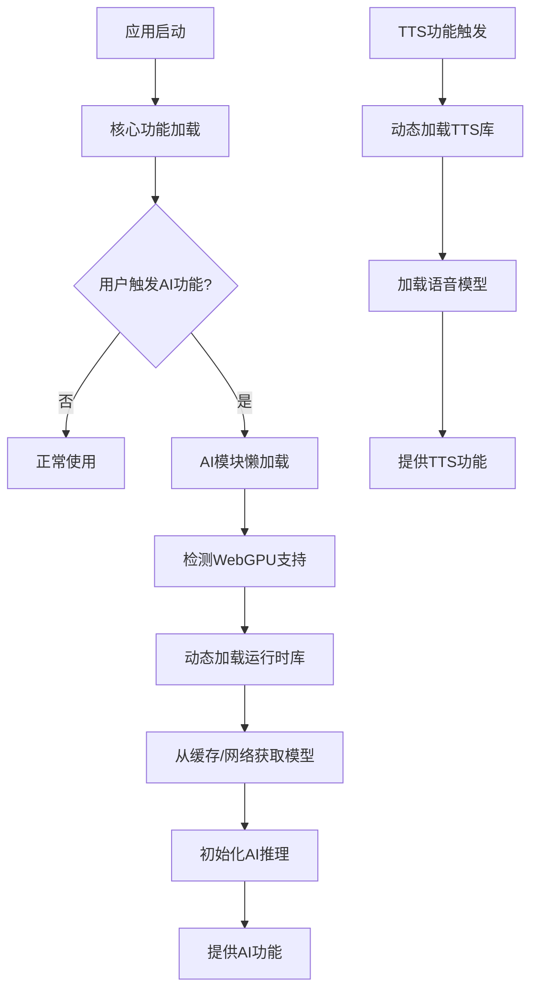
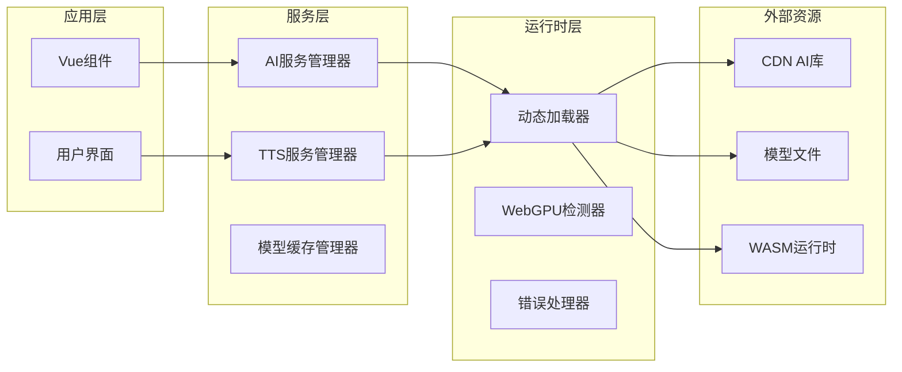

# 端侧AI运行时优化设计文档

## 概述

本设计文档描述了如何优化Nexus Reader的端侧AI功能，将构建产物从205MB减少到50MB以下，同时保持AI和TTS功能的完整性。核心策略是将大型AI库配置为运行时动态加载，避免将WASM文件和模型数据打包到构建产物中。

## 架构设计

### 整体架构



### 模块分层设计



## 组件设计

### 1. AI服务管理器 (AIServiceManager)

负责管理AI功能的生命周期和资源加载，集成现有的AI设置和模型管理。

**接口设计:**
```typescript
interface AIServiceManager {
  // 初始化AI服务
  initialize(): Promise<void>
  
  // 检测WebGPU支持
  detectWebGPUSupport(): Promise<boolean>
  
  // 加载模型（支持现有的模型选择）
  loadModel(modelId: string): Promise<void>
  
  // 执行AI推理（使用现有的AI参数配置）
  inference(prompt: string, params?: AIRequestParams): Promise<string>
  
  // 获取推荐模型列表（集成现有的模型筛选逻辑）
  getRecommendedModels(): ModelInfo[]
  
  // 获取所有可用模型
  getAllModels(): ModelInfo[]
  
  // 卸载当前模型
  unloadModel(): void
  
  // 清理资源
  cleanup(): void
  
  // 状态查询
  get isModelLoaded(): boolean
  get currentModel(): string | null
  get isLoading(): boolean
  get loadProgress(): number
  get loadStatus(): string
}
```

**实现策略:**
- 集成现有的useAIStore状态管理
- 使用动态import()加载@mlc-ai/web-llm
- 复用现有的模型推荐算法和筛选逻辑
- 保持与现有AI设置页面的兼容性
- 实现WebGPU降级到CPU的自动切换
- 支持现有的AI参数配置（temperature、maxTokens等）

### 2. TTS服务管理器 (TTSServiceManager)

管理TTS功能的动态加载和语音合成，集成现有的TTS设置。

**接口设计:**
```typescript
interface TTSServiceManager {
  // 初始化TTS服务
  initialize(): Promise<void>
  
  // 加载语音模型（支持现有的piper语音配置）
  loadVoiceModel(modelUrl: string): Promise<void>
  
  // 文本转语音（使用现有的TTS参数）
  synthesize(text: string, options?: TTSOptions): Promise<AudioBuffer>
  
  // 获取可用语音列表（集成现有的语音管理）
  getAvailableVoices(): Promise<Voice[]>
  
  // 设置默认语音（集成现有的语音设置）
  setDefaultVoice(voiceId: string): Promise<void>
  
  // 获取当前TTS引擎设置
  getCurrentEngine(): TTSEngine
  
  // 切换TTS引擎
  switchEngine(engine: TTSEngine): Promise<void>
}

interface TTSOptions {
  rate?: number // 语速，集成现有的ttsRate设置
  voice?: string // 语音ID
  engine?: TTSEngine // TTS引擎选择
}
```

**实现策略:**
- 集成现有的useVoiceStore状态管理
- 延迟加载piper-tts-web库
- 支持现有的TTS引擎切换（system/piper）
- 复用现有的语音配置和管理逻辑
- 支持自定义训练的音色模型
- 实现语音模型的增量加载
- 保持与现有TTS设置的兼容性

### 3. 动态加载器 (DynamicLoader)

核心组件，负责运行时资源的动态加载。

**接口设计:**
```typescript
interface DynamicLoader {
  // 加载外部库
  loadLibrary(name: string, url: string): Promise<any>
  
  // 加载WASM模块
  loadWASM(url: string): Promise<WebAssembly.Module>
  
  // 加载模型文件
  loadModel(url: string, progressCallback?: (progress: number) => void): Promise<ArrayBuffer>
  
  // 检查资源缓存
  checkCache(key: string): Promise<boolean>
  
  // 清理缓存
  clearCache(pattern?: string): Promise<void>
}
```

**实现策略:**
- 使用Service Worker进行资源缓存
- 实现断点续传和重试机制
- 支持资源完整性验证
- 提供加载进度和错误处理

### 4. 模型缓存管理器 (ModelCacheManager)

管理AI模型和运行时库的本地缓存。

**接口设计:**
```typescript
interface ModelCacheManager {
  // 缓存模型
  cacheModel(key: string, data: ArrayBuffer, metadata: ModelMetadata): Promise<void>
  
  // 获取缓存模型
  getCachedModel(key: string): Promise<ArrayBuffer | null>
  
  // 检查缓存状态
  getCacheStatus(): Promise<CacheStatus>
  
  // 清理过期缓存
  cleanupExpiredCache(): Promise<void>
  
  // 预加载常用模型
  preloadModels(modelList: string[]): Promise<void>
}
```

**实现策略:**
- 使用IndexedDB存储大型模型文件
- 实现LRU缓存淘汰策略
- 支持缓存压缩和加密
- 提供缓存使用统计和分析

## 数据模型

### AI模型配置（集成现有设置）
```typescript
interface AIModelConfig {
  name: string
  version: string
  url: string
  size: number
  checksum: string
  capabilities: string[]
  requirements: {
    webgpu: boolean
    memory: number
    storage: number
  }
  // 集成现有的模型信息
  vendor: string
  params: string
  quantization: string
  contextWindow: number
  series: string
}

// 集成现有的AI参数配置
interface AIParams {
  temperature: number // 随机性 (0-2)
  topP: number // 核采样 (0-1)
  maxTokens: number // 单次回复限制
  contextWindow: number // 上下文窗口长度
  presencePenalty: number // 话题新鲜度 (-2 to 2)
  frequencyPenalty: number // 频率惩罚度 (-2 to 2)
}
```

### TTS语音配置（集成现有设置）
```typescript
interface VoiceConfig {
  id: string
  name: string
  language: string
  gender: 'male' | 'female' | 'neutral'
  modelUrl: string
  sampleRate: number
  quality: 'low' | 'medium' | 'high'
  // 集成现有的TTS设置
  engine: TTSEngine // 'system' | 'piper'
  rate: number // 语速设置
}

// 集成现有的TTS引擎类型
type TTSEngine = 'system' | 'piper'
```

### 缓存元数据
```typescript
interface CacheMetadata {
  key: string
  size: number
  createdAt: Date
  lastAccessed: Date
  expiresAt: Date
  version: string
  integrity: string
}
```

## 构建配置优化

### Webpack/Rspack外部化配置（集成现有构建配置）

```typescript
// rsbuild.config.ts 优化配置（基于现有配置）
export default defineConfig({
  tools: {
    rspack: {
      externals: {
        // 将大型AI库标记为外部依赖
        '@huggingface/transformers': 'HuggingFaceTransformers',
        '@mlc-ai/web-llm': 'WebLLM',
        'onnxruntime-web': 'ort',
        'piper-tts-web': 'PiperTTS'
      },
      optimization: {
        // 保持现有的优化配置
        usedExports: true,
        sideEffects: false,
        minimize: process.env.NODE_ENV === 'production',
        concatenateModules: true,
        splitChunks: {
          cacheGroups: {
            // 保持现有的Vue框架分离
            vue: {
              test: /[\\/]node_modules[\\/](vue|vue-router|pinia|@vueuse)[\\/]/,
              name: "lib-vue",
              chunks: "all",
              priority: 20,
            },
            // 保持现有的UI库分离
            ui: {
              test: /[\\/]node_modules[\\/](reka-ui|lucide-vue-next)[\\/]/,
              name: "lib-ui",
              chunks: "all",
              priority: 10,
            },
            // 优化AI相关代码分离 - 完全异步加载
            ai: {
              test: /[\\/]node_modules[\\/](onnxruntime-web|@huggingface|@mlc-ai)[\\/]/,
              name: "lib-ai",
              chunks: "async", // 强制异步加载
              priority: 50,
              enforce: true, // 强制分离
            },
            // 优化TTS库分离 - 完全异步加载
            tts: {
              test: /[\\/]node_modules[\\/](piper-tts-web)[\\/]/,
              name: "lib-tts",
              chunks: "async", // 强制异步加载
              priority: 45,
              enforce: true, // 强制分离
            },
            // AI服务相关代码分离
            'ai-services': {
              test: /[\\/]src[\\/](stores[\\/]ai|services[\\/](ai|tts)|pages[\\/]ai-)/,
              name: 'ai-services',
              chunks: 'async',
              priority: 40,
              enforce: true
            }
          }
        }
      }
    }
  },
  output: {
    // 移除大文件复制配置
    copy: [
      // 不再预复制WASM和模型文件
      // 改为运行时按需加载
    ],
  }
})
```

### CDN资源配置

```typescript
// 运行时CDN资源映射
const CDN_RESOURCES = {
  '@mlc-ai/web-llm': 'https://cdn.jsdelivr.net/npm/@mlc-ai/web-llm@latest/dist/index.js',
  'onnxruntime-web': 'https://cdn.jsdelivr.net/npm/onnxruntime-web@latest/dist/ort.min.js',
  'piper-tts-web': 'https://cdn.jsdelivr.net/npm/piper-tts-web@latest/dist/index.js'
}
```

## 错误处理策略

### 错误类型定义
```typescript
enum AIErrorType {
  WEBGPU_NOT_SUPPORTED = 'webgpu_not_supported',
  MODEL_LOAD_FAILED = 'model_load_failed',
  INFERENCE_FAILED = 'inference_failed',
  NETWORK_ERROR = 'network_error',
  CACHE_ERROR = 'cache_error',
  MEMORY_INSUFFICIENT = 'memory_insufficient'
}
```

### 降级策略
1. **WebGPU不可用**: 自动切换到CPU推理模式
2. **模型加载失败**: 使用缓存模型或提示用户重试
3. **网络错误**: 启用离线模式，使用本地缓存
4. **内存不足**: 清理缓存，使用轻量级模型
5. **推理失败**: 重试机制，错误上报

## 正确性属性

*属性是一个特征或行为，应该在系统的所有有效执行中保持为真——本质上是关于系统应该做什么的正式声明。属性作为人类可读规范和机器可验证正确性保证之间的桥梁。*

### 属性1: 构建大小限制
*对于任何*生产构建，构建产物的总大小应该不超过50MB
**验证: 需求 1.1**

### 属性2: WASM文件外部化
*对于任何*构建产物分析，AI相关的WASM文件应该不存在于bundle中
**验证: 需求 1.2**

### 属性3: 模型文件排除
*对于任何*静态资源检查，模型文件(.onnx, .bin等)应该不包含在构建产物中
**验证: 需求 1.3**

### 属性4: 大小减少目标
*对于任何*优化前后对比，构建大小减少应该达到至少75%
**验证: 需求 1.4**

### 属性5: 启动时资源延迟加载
*对于任何*应用启动过程，AI相关的WASM文件和模型数据不应该被预加载
**验证: 需求 2.1**

### 属性6: AI功能动态加载
*对于任何*首次AI功能使用，系统应该动态加载所需的运行时库
**验证: 需求 2.2**

### 属性7: 外部依赖配置
*对于任何*大型AI库，应该被标记为external或通过CDN加载
**验证: 需求 2.3**

### 属性8: WASM网络加载
*对于任何*WASM文件访问，应该通过网络请求获取而非bundle内嵌
**验证: 需求 2.4**

### 属性9: WebGPU检测和降级
*对于任何*WebGPU初始化，系统应该检测设备支持并在不支持时提供降级方案
**验证: 需求 3.1, 3.5**

### 属性10: 模型动态下载
*对于任何*Qwen3模型加载，应该从指定URL动态下载量化模型文件
**验证: 需求 3.2**

### 属性11: 模型缓存机制
*对于任何*模型加载完成，模型应该被缓存到IndexedDB中避免重复下载
**验证: 需求 3.3**

### 属性12: WebGPU推理加速
*对于任何*AI推理请求，在WebGPU可用时应该使用WebGPU加速
**验证: 需求 3.4**

### 属性13: TTS延迟加载
*对于任何*应用启动，piper-tts-web的WASM文件和模型数据不应该被加载
**验证: 需求 4.1**

### 属性14: TTS动态加载
*对于任何*首次TTS使用，系统应该动态加载TTS运行时和语音模型
**验证: 需求 4.2**

### 属性15: 自定义TTS模型支持
*对于任何*TTS模型配置，系统应该支持从远程URL加载自定义训练的音色模型
**验证: 需求 4.3**

### 属性16: TTS模型缓存
*对于任何*TTS模型加载完成，模型数据应该被缓存以提升后续使用体验
**验证: 需求 4.4**

### 属性17: 智能预加载
*对于任何*频繁使用的AI功能，系统应该在空闲时预加载常用模型
**验证: 需求 5.1**

### 属性18: 网络状况预加载
*对于任何*网络状况良好的情况，系统应该在后台预加载AI运行时库
**验证: 需求 5.2**

### 属性19: 存储空间管理
*对于任何*存储空间不足的情况，系统应该自动清理最少使用的模型缓存
**验证: 需求 5.3**

### 属性20: 模型版本更新
*对于任何*模型版本更新，系统应该自动更新缓存中的模型文件
**验证: 需求 5.4**

### 属性21: 离线功能支持
*对于任何*离线使用场景，系统应该使用已缓存的模型和运行时提供基本AI功能
**验证: 需求 5.5**

### 属性22: Webpack外部化配置
*对于任何*大型AI库，应该在webpack externals中被排除在bundle之外
**验证: 需求 6.1**

### 属性23: 代码分割策略
*对于任何*AI相关代码，应该被分离到独立的异步chunk中
**验证: 需求 6.2**

### 属性24: Tree Shaking优化
*对于任何*未使用的AI库代码和依赖，应该通过tree shaking被移除
**验证: 需求 6.3**

### 属性25: CDN资源加载
*对于任何*AI运行时库，应该支持从CDN加载
**验证: 需求 6.4**

### 属性26: Source Map排除
*对于任何*AI库的source map，应该被排除以减少构建大小
**验证: 需求 6.5**

### 属性27: 错误处理和用户提示
*对于任何*AI库加载失败，系统应该记录详细错误信息并提供用户友好的提示
**验证: 需求 7.1**

### 属性28: 性能监控
*对于任何*AI库和模型加载，系统应该记录加载时间
**验证: 需求 7.2**

### 属性29: 超时重试机制
*对于任何*加载超时情况，系统应该提供重试机制和降级方案
**验证: 需求 7.3**

### 属性30: WebGPU失败处理
*对于任何*WebGPU初始化失败，系统应该自动切换到CPU模式并通知用户
**验证: 需求 7.4**

### 属性31: 推理错误恢复
*对于任何*模型推理出错，系统应该提供错误恢复机制和用户反馈
**验证: 需求 7.5**

### 属性32: 环境变量配置切换
*对于任何*不同的环境变量设置，系统应该支持切换AI库加载策略
**验证: 需求 8.4**

## 测试策略

### 双重测试方法
- **单元测试**: 验证特定示例、边界情况和错误条件
- **属性测试**: 验证所有输入的通用属性
- 两者互补且都是全面覆盖所必需的

### 属性测试配置
- 每个属性测试最少运行100次迭代
- 每个测试必须引用其设计文档属性
- 标签格式: **功能: client-side-ai-optimization, 属性 {编号}: {属性文本}**

### 单元测试重点
- AI服务管理器的模型加载和推理功能
- TTS服务的语音合成和播放功能
- 动态加载器的资源加载和缓存功能
- 错误处理和降级策略的正确性

### 集成测试
- 端到端的AI功能流程测试
- 不同网络条件下的加载性能测试
- WebGPU和CPU模式的切换测试
- 缓存策略的有效性测试

### 性能测试
- 构建产物大小验证（目标<50MB）
- AI模型加载时间测试
- 推理性能基准测试
- 内存使用情况监控