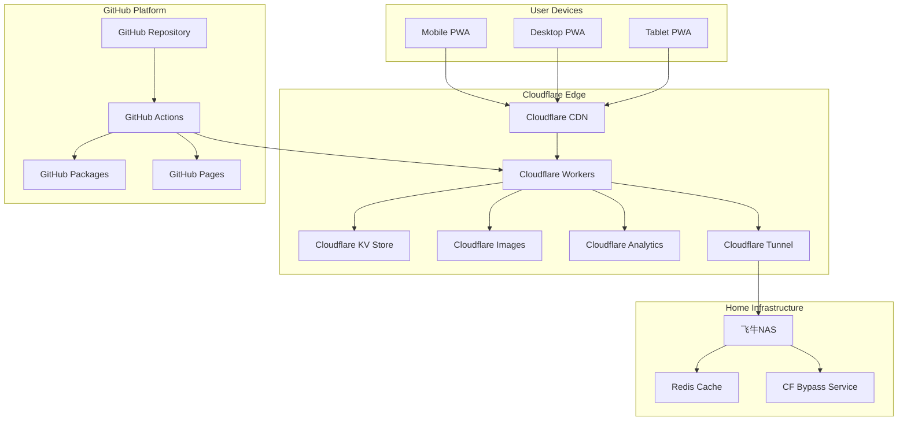

# Design Document

## Overview

This design document outlines the architecture and implementation strategy for maximizing GitHub and Cloudflare free tier services to transform Nexus Reader into a modern, globally accessible personal cloud platform. The system will leverage edge computing, automated CI/CD, intelligent caching, and AI-enhanced features while maintaining zero operational costs.

## Architecture

### High-Level Architecture



### Component Architecture

The system follows a distributed, edge-first architecture with the following key components:

1. **Edge Layer (Cloudflare)**: Handles global traffic distribution, caching, security, and edge computing
2. **CI/CD Layer (GitHub)**: Manages code, automated testing, building, and deployment
3. **Origin Layer (NAS)**: Provides core application logic and data storage
4. **Client Layer (PWA)**: Delivers native-like experience across all devices

## Components and Interfaces

### 1. GitHub Integration Components

#### Dependency Management Service
- **Purpose**: Automated dependency updates and security scanning
- **Interface**: GitHub Dependabot API, CodeQL API
- **Implementation**: GitHub Actions workflows with custom scripts
- **Data Flow**: Repository → Dependabot → Pull Requests → CodeQL → Security Reports

#### CI/CD Pipeline
- **Purpose**: Automated building, testing, and deployment
- **Interface**: GitHub Actions API, Docker Registry API
- **Implementation**: Multi-stage workflows with caching and optimization
- **Data Flow**: Code Push → Actions → Build → Test → Package → Deploy

#### Documentation System
- **Purpose**: Automated documentation generation and hosting
- **Interface**: GitHub Pages API, Markdown processors
- **Implementation**: Static site generation with automated updates
- **Data Flow**: Code Changes → Documentation Generation → GitHub Pages

### 2. Cloudflare Edge Components

#### Tunnel Manager
- **Purpose**: Secure external access without port forwarding
- **Interface**: Cloudflare Tunnel API, DNS API
- **Implementation**: Cloudflared daemon with automatic failover
- **Data Flow**: External Request → Cloudflare Edge → Tunnel → NAS

#### CDN and Caching Layer
- **Purpose**: Global content distribution and performance optimization
- **Interface**: Cloudflare Cache API, Purge API
- **Implementation**: Multi-tier caching with intelligent invalidation
- **Data Flow**: User Request → CDN → Cache Check → Origin/Cache Response

#### Workers Runtime
- **Purpose**: Edge computing for API proxying and business logic
- **Interface**: Workers API, KV API, Durable Objects API
- **Implementation**: JavaScript/TypeScript workers with TypeScript types
- **Data Flow**: API Request → Workers → Business Logic → KV/Origin → Response

#### Image Optimization Service
- **Purpose**: Automatic image optimization and transformation
- **Interface**: Cloudflare Images API, Transform API
- **Implementation**: On-demand image processing with caching
- **Data Flow**: Image Request → Images Service → Transform → CDN → User

### 3. Application Components

#### PWA Shell
- **Purpose**: Native app-like experience with offline capabilities
- **Interface**: Service Worker API, Web App Manifest API
- **Implementation**: React/Vue.js with Workbox for service worker
- **Data Flow**: User Interaction → PWA → Service Worker → Cache/Network

#### Sync Engine
- **Purpose**: Multi-device data synchronization
- **Interface**: WebSocket API, KV API, Conflict Resolution API
- **Implementation**: Event-driven sync with operational transformation
- **Data Flow**: Device Update → Sync Engine → KV Store → Other Devices

#### AI Enhancement Layer
- **Purpose**: Intelligent recommendations and content analysis
- **Interface**: Cloudflare Workers AI API, OpenAI API
- **Implementation**: Edge AI with request batching and caching
- **Data Flow**: User Data → AI Workers → ML Models → Recommendations

### 4. Monitoring and Analytics

#### Performance Monitor
- **Purpose**: Real-time performance tracking and optimization
- **Interface**: Cloudflare Analytics API, Custom Metrics API
- **Implementation**: Custom analytics with dashboard visualization
- **Data Flow**: User Actions → Analytics → Metrics → Dashboard

#### Health Check System
- **Purpose**: Automated system health monitoring and alerting
- **Interface**: GitHub Actions API, Webhook API, Email API
- **Implementation**: Scheduled health checks with multi-channel alerting
- **Data Flow**: Health Check → Status Evaluation → Alert System → Notifications

## Data Models

### User Data Model
```typescript
interface User {
  id: string;
  preferences: UserPreferences;
  readingProgress: ReadingProgress[];
  bookmarks: Bookmark[];
  syncTimestamp: number;
}

interface UserPreferences {
  theme: 'light' | 'dark' | 'auto';
  fontSize: number;
  fontFamily: string;
  readingMode: 'scroll' | 'page';
  autoSync: boolean;
}
```

### Content Data Model
```typescript
interface Novel {
  id: string;
  title: string;
  author: string;
  description: string;
  chapters: Chapter[];
  metadata: NovelMetadata;
  aiTags: string[];
  lastUpdated: number;
}

interface Chapter {
  id: string;
  title: string;
  content: string;
  wordCount: number;
  readingTime: number;
}
```

### Sync Data Model
```typescript
interface SyncEvent {
  id: string;
  userId: string;
  deviceId: string;
  eventType: 'progress' | 'bookmark' | 'preference';
  data: any;
  timestamp: number;
  conflictResolution?: ConflictResolution;
}

interface ConflictResolution {
  strategy: 'last-write-wins' | 'merge' | 'manual';
  resolvedData: any;
  conflictTimestamp: number;
}
```

### Analytics Data Model
```typescript
interface AnalyticsEvent {
  eventType: string;
  userId?: string;
  sessionId: string;
  timestamp: number;
  properties: Record<string, any>;
  performance?: PerformanceMetrics;
}

interface PerformanceMetrics {
  loadTime: number;
  renderTime: number;
  cacheHitRate: number;
  errorRate: number;
}
```

## Correctness Properties

*A property is a characteristic or behavior that should hold true across all valid executions of a system-essentially, a formal statement about what the system should do. Properties serve as the bridge between human-readable specifications and machine-verifiable correctness guarantees.*

Based on the prework analysis, the following correctness properties ensure system reliability and functionality:

### Property 1: Automated Dependency Management
*For any* outdated dependency or security vulnerability detected in the repository, the system should automatically create a pull request with the appropriate updates and security fixes.
**Validates: Requirements 1.1, 1.3**

### Property 2: Security Scanning Automation
*For any* code commit to the repository, the system should trigger automated security scanning and generate reports when vulnerabilities are detected.
**Validates: Requirements 1.2**

### Property 3: Secure External Access
*For any* external network access attempt, the system should provide secure tunnel-based connectivity without requiring router port forwarding.
**Validates: Requirements 2.1**

### Property 4: CDN Resource Serving
*For any* static resource request, the system should serve it through Cloudflare CDN with appropriate caching headers.
**Validates: Requirements 2.2**

### Property 5: Malicious Traffic Blocking
*For any* detected malicious traffic, the system should automatically block it using Cloudflare security features.
**Validates: Requirements 2.4**

### Property 6: Image Optimization
*For any* image displayed in the application, the system should automatically optimize it using Cloudflare Images with appropriate formats and sizes for the requesting device.
**Validates: Requirements 3.3**

### Property 7: PWA Installation Support
*For any* mobile device accessing the application, the system should provide proper PWA installation prompts and manifest configuration.
**Validates: Requirements 4.1, 4.3**

### Property 8: Offline Content Access
*For any* previously cached novel or reading progress, the system should provide access when users are offline.
**Validates: Requirements 4.2**

### Property 9: Offline-Online Sync
*For any* reading progress updated offline, the system should sync changes when connectivity is restored.
**Validates: Requirements 4.4**

### Property 10: Real-time Progress Sync
*For any* reading progress update on one device, the system should sync it to all other devices within the specified time limit.
**Validates: Requirements 5.1**

### Property 11: Preference Synchronization
*For any* user preference change, the system should store it in Cloudflare KV and sync across all devices.
**Validates: Requirements 5.2**

### Property 12: Conflict Resolution
*For any* data conflict between devices, the system should resolve it using last-write-wins with timestamp comparison.
**Validates: Requirements 5.3**

### Property 13: Offline-Online Merge
*For any* device coming online after being offline, the system should merge offline changes with server state.
**Validates: Requirements 5.4**

### Property 14: Immediate Cloud Sync
*For any* user bookmark or note added, the system should immediately sync it to cloud storage.
**Validates: Requirements 5.5**

### Property 15: AI Recommendations
*For any* user viewing novels, the system should provide AI-powered recommendations based on their reading history.
**Validates: Requirements 6.1**

### Property 16: Semantic Search
*For any* user search query, the system should support semantic search using natural language processing.
**Validates: Requirements 6.2**

### Property 17: Automatic Categorization
*For any* novel added to the system, the system should automatically categorize and tag it using AI analysis.
**Validates: Requirements 6.3**

### Property 18: Analytics Tracking
*For any* user access to the application, the system should track performance metrics using Cloudflare Analytics.
**Validates: Requirements 7.1**

### Property 19: Error Logging and Alerting
*For any* error that occurs in the system, the system should log it with sufficient detail for debugging and send appropriate alerts.
**Validates: Requirements 7.2**

### Property 20: Health Check Validation
*For any* system health check execution, the system should verify all components are functioning correctly.
**Validates: Requirements 7.3**

### Property 21: Resource Limit Warnings
*For any* resource limit being approached, the system should send proactive warnings before hitting the limits.
**Validates: Requirements 7.5**

### Property 22: End-to-End Encryption
*For any* data transmission between client and server, the system should use end-to-end encryption.
**Validates: Requirements 8.1**

### Property 23: Data Encryption at Rest
*For any* sensitive data stored in cloud services, the system should encrypt it before storage.
**Validates: Requirements 8.3**

### Property 24: Secure Authentication
*For any* authentication requirement, the system should use secure authentication mechanisms.
**Validates: Requirements 8.4**

### Property 25: Privacy-Compliant Logging
*For any* access log generated, the system should not store personally identifiable information unnecessarily.
**Validates: Requirements 8.5**

### Property 26: Automated Deployment
*For any* code push to the main branch, the system should automatically build and deploy to production.
**Validates: Requirements 9.1**

### Property 27: Automatic Rollback
*For any* deployment health check failure, the system should automatically rollback to the previous version.
**Validates: Requirements 9.2**

### Property 28: Configuration Validation
*For any* configuration change made, the system should validate it before applying to production.
**Validates: Requirements 9.3**

### Property 29: Post-Deployment Testing
*For any* deployment completion, the system should run smoke tests to verify functionality.
**Validates: Requirements 9.4**

### Property 30: Deployment Notifications
*For any* deployment status change, the system should notify relevant stakeholders through configured channels.
**Validates: Requirements 9.5**

### Property 31: Intelligent Storage Cleanup
*For any* data stored in KV approaching the 1GB limit, the system should manage it with intelligent cleanup mechanisms.
**Validates: Requirements 10.3**

### Property 32: AI Request Batching
*For any* AI features being used, the system should batch requests to maximize the daily limit efficiency.
**Validates: Requirements 10.5**

## Error Handling

### Error Categories and Strategies

1. **Network Errors**: Implement exponential backoff with circuit breaker pattern
2. **Authentication Errors**: Automatic token refresh with fallback to re-authentication
3. **Rate Limiting Errors**: Intelligent request queuing and batching
4. **Storage Errors**: Graceful degradation with local fallback
5. **AI Processing Errors**: Fallback to traditional algorithms when AI services are unavailable

### Error Recovery Mechanisms

- **Automatic Retry**: For transient failures with exponential backoff
- **Circuit Breaker**: To prevent cascade failures in distributed components
- **Graceful Degradation**: Core functionality remains available when optional services fail
- **Local Fallback**: PWA continues working offline when cloud services are unavailable
- **Health Monitoring**: Proactive detection and automatic recovery from common failure modes

## Testing Strategy

### Dual Testing Approach

The system will employ both unit testing and property-based testing for comprehensive coverage:

**Unit Tests**: Verify specific examples, edge cases, and error conditions
- Integration points between components
- Edge cases and boundary conditions
- Error handling scenarios
- Configuration validation

**Property Tests**: Verify universal properties across all inputs
- Business logic correctness across random inputs
- Data consistency and synchronization
- Security and privacy requirements
- Performance characteristics

### Property-Based Testing Configuration

- **Testing Framework**: Use fast-check for JavaScript/TypeScript property testing
- **Test Iterations**: Minimum 100 iterations per property test
- **Test Tagging**: Each property test tagged with format: **Feature: free-tier-maximization, Property {number}: {property_text}**
- **Coverage Requirements**: Each correctness property implemented by exactly one property-based test
- **Integration**: Property tests integrated into CI/CD pipeline with GitHub Actions

### Testing Environments

1. **Local Development**: Fast feedback loop with mocked external services
2. **Staging**: Full integration testing with actual Cloudflare and GitHub services
3. **Production**: Continuous monitoring and synthetic testing
4. **Canary**: Gradual rollout with real user traffic monitoring