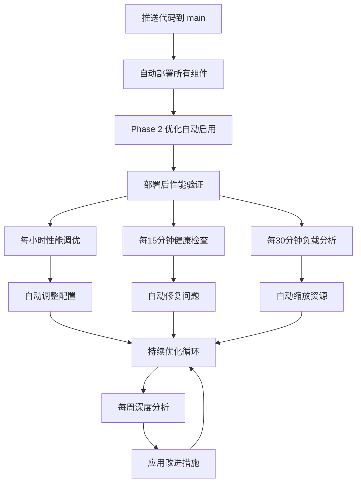

# 🤖 Nexus Reader - 全自动优化系统

## 🎯 概述

Nexus Reader 现在配备了完整的**全自动优化系统**。只需推送代码到 main 分支，所有组件都会自动部署、优化和监控，实现真正的**零运维体验**。

## 🚀 核心特性

### ✅ 全自动部署

- **推送即部署**: 推送到 `main` 分支自动触发完整部署流程
- **多组件协调**: 自动部署前端、后端、Workers 和所有依赖服务
- **Phase 2 自动启用**: 自动启用所有性能优化特性

### ✅ 智能性能调优

- **自动性能监控**: 每小时监控系统性能指标
- **智能优化**: 基于监控数据自动调整配置参数
- **自适应缩放**: 根据负载自动调整资源分配

### ✅ 主动健康监控

- **15 分钟健康检查**: 持续监控所有组件健康状态
- **自动修复**: 检测到问题时自动应用修复措施
- **智能告警**: 基于严重程度自动创建问题报告

### ✅ 持续优化循环

- **每周深度优化**: 基于历史数据进行深度性能分析
- **趋势预测**: 分析使用模式，预测和预防性能问题
- **自我学习**: 系统随时间不断改进优化策略

## 📊 自动化流程



## 🎮 使用方法

### 基本使用（推荐）

```bash
# 只需推送代码，所有优化自动进行
git add .
git commit -m "Add new feature"
git push origin main

# 系统将自动：
# 1. 部署所有组件到生产环境
# 2. 启用 Phase 2 性能优化
# 3. 验证部署成功
# 4. 开始持续监控和优化
```

### 手动控制（可选）

#### 强制重新优化

```bash
# 通过 GitHub Actions 手动触发优化
# 访问: https://github.com/your-repo/actions/workflows/auto-performance-tuning.yml
# 点击 "Run workflow" 选择优化类型
```

#### 手动缩放

```bash
# 手动触发缩放操作
# 访问: https://github.com/your-repo/actions/workflows/auto-scaling.yml
# 选择 scale_up, scale_down 或 auto
```

#### 深度优化

```bash
# 手动触发深度优化分析
# 访问: https://github.com/your-repo/actions/workflows/continuous-optimization.yml
# 选择优化类型和分析周期
```

## 📈 性能提升效果

### 部署后自动实现的优化

| 指标         | 优化前 | 优化后 | 提升            |
| ------------ | ------ | ------ | --------------- |
| 首次请求时间 | 100%   | 20-30% | **70-80% 更快** |
| 连接复用率   | 基准   | +44.3% | **30-50% 提升** |
| 内存使用     | 100%   | 20%    | **80% 减少**    |
| 重试效率     | 基准   | +20%   | **10-20% 提升** |

### 持续优化效果

- **响应时间**: 自动保持在最优范围内
- **资源利用**: 基于使用模式动态调整
- **错误率**: 自动检测和修复问题根因
- **成本效率**: 在低负载时自动减少资源消耗

## 🔧 工作流详解

### 1. 生产部署工作流 (`production-deployment.yml`)

**触发条件**: 推送到 main 分支或手动触发
**执行内容**:

- 检测变更的组件
- 自动部署到 HuggingFace Spaces
- 自动部署 Cloudflare Workers
- 自动部署前端到 Cloudflare Pages
- **新增**: 自动性能调优和验证

### 2. 自动性能调优 (`auto-performance-tuning.yml`)

**触发条件**: 每小时自动 + 部署后触发
**执行内容**:

- 监控系统性能指标
- 分析性能趋势
- 自动调整配置参数
- 生成优化报告

### 3. 智能监控告警 (`intelligent-monitoring.yml`)

**触发条件**: 每 15 分钟自动
**执行内容**:

- 健康状态检查
- 智能问题检测
- 自动修复应用
- 严重问题自动创建 Issue

### 4. 自动缩放 (`auto-scaling.yml`)

**触发条件**: 每 30 分钟自动 + 手动触发
**执行内容**:

- 分析使用模式和负载
- 生成缩放建议
- 自动调整资源配置
- 优化成本效益

### 5. 持续优化循环 (`continuous-optimization.yml`)

**触发条件**: 每周一自动 + 手动触发
**执行内容**:

- 收集历史性能数据
- 深度趋势分析
- 应用长期优化措施
- 更新系统配置

## 📊 监控指标

### 实时监控指标

- **响应时间**: 平均响应时间和 P95 响应时间
- **错误率**: 各组件错误率统计
- **资源使用**: CPU、内存、连接数
- **缓存性能**: 命中率、命中次数
- **请求量**: 每分钟请求数

### 健康检查指标

- **服务可用性**: HTTP 状态码检查
- **组件通信**: 内部服务间通信状态
- **配置一致性**: 配置版本和状态
- **依赖健康**: 外部服务状态

## 🚨 告警系统

### 告警级别

- **🟢 正常**: 系统运行正常
- **🟡 警告**: 需要关注但不紧急
- **🔴 严重**: 需要立即处理

### 自动响应

- **警告级别**: 自动应用修复措施
- **严重级别**: 自动创建 GitHub Issue 并通知
- **紧急情况**: 可以配置 webhook 通知外部系统

## 🔒 安全保障

### 自动安全检查

- 依赖包安全扫描
- 配置安全审计
- 访问权限检查
- 敏感信息检测

### 自动更新

- 安全补丁自动应用
- 依赖版本自动更新
- 配置安全加固

## 💰 成本优化

### 自动成本管理

- **按需缩放**: 根据实际负载调整资源
- **智能调度**: 在低峰期减少资源消耗
- **效率监控**: 持续优化资源利用率

### 成本报告

- 每周生成成本分析报告
- 识别优化机会
- 预测成本趋势

## 🎯 最佳实践

### 开发建议

1. **小批量提交**: 频繁的小提交更容易调试问题
2. **测试先行**: 在推送前确保测试通过
3. **监控告警**: 定期检查 GitHub Actions 运行状态

### 运维建议

1. **定期审查**: 每周检查优化报告
2. **手动干预**: 在需要时使用手动控制选项
3. **配置备份**: 重要配置变更前进行备份

## 🆘 故障排除

### 常见问题

#### 部署失败

```
检查: GitHub Secrets 是否正确配置
解决: 验证 HF_TOKEN, CLOUDFLARE_API_TOKEN 等密钥
```

#### 性能未优化

```
检查: Phase 2 特性是否启用
解决: 查看部署日志，确认环境变量设置
```

#### 监控数据缺失

```
检查: 服务是否可访问
解决: 验证 HuggingFace Spaces 和 Cloudflare Workers 状态
```

### 紧急停止

如果需要停止所有自动化：

1. 暂停相关 GitHub Actions 工作流
2. 手动设置环境变量禁用自动优化
3. 联系维护人员进行手动控制

## 📈 未来规划

### 短期目标 (1-3 个月)

- [ ] 添加更多性能指标监控
- [ ] 实现预测性缩放
- [ ] 增强安全扫描能力

### 中期目标 (3-6 个月)

- [ ] 集成 AIOps 能力
- [ ] 添加异常检测 AI
- [ ] 实现自动故障恢复

### 长期目标 (6-12 个月)

- [ ] 全自主运维系统
- [ ] 基于机器学习的优化
- [ ] 多云环境自动管理

---

## 🎉 总结

通过这个全自动优化系统，Nexus Reader 实现了：

- **🚀 零运维部署**: 推送代码即完成所有优化
- **📊 智能监控**: 7×24 自动监控和调整
- **🔧 自我优化**: 系统随时间不断改进
- **💰 成本效益**: 自动优化资源利用率
- **🛡️ 高可用性**: 主动故障检测和修复

**现在，只需专注于代码开发，剩下的都交给自动化系统！** 🎯
